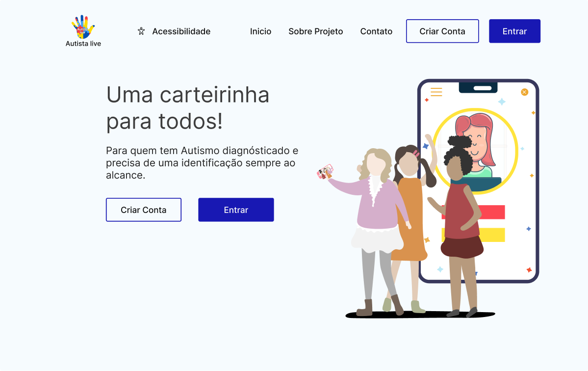
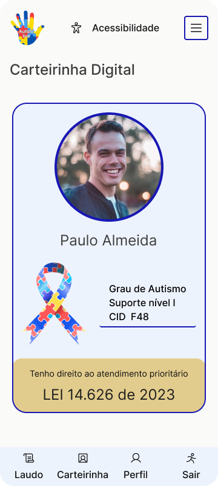

#  Autista.live

Autista.live é uma solução de identificação digital desenvolvida para atender uma necessidade da comunidade autista. 

Este software foi projetado com o objetivo de oferecer uma maneira eficaz e personalizada de fornecer o laudo e uma identificação eletronica na palma da sua mão. 

Com Autista.live, o usuário tem um perfil digital com foto, laudo e identificação digital, incluindo detalhes relevantes e necessidades de acordo com o laudo.


 🖥️ Versão web                                                     |  📱 Versão Mobile
:----------:                                                      |  :--------------:
         |  

## ⚙️ Funcionalidades

- ✅ Login de usuário
- ☑️ Recuperação de senha
- ✅ Design responsivo
- ☑️ Projeto em NUXT.js
- ✅ Site com acessibilidade
- ☑️ HTML semântico

## 🧰 Bibliotecas

- ✅ NUXT
- ☑️ Phosphor Icons


## ⬇️ Rodando o projeto

| **Obs: 

```bash
$ npm install
$ cp .env.example .env
$ npm run dev
```


#### 1. Para a aplicação funcionar corretamente é necessário a instalação do [Backend](https://github.com/Autistalive/autistalive-api/#instala%C3%A7%C3%A3o)

2. Após clonar este repositório abra o terminal e insira os comandos abaixo

3. Instale as depedências do projeto 
    > $ npm install

4. Crie um arquivo com as variáveis de ambiente 
    > $ cp .env.example .env

5. Rode o projeto
    >$ npm run dev
  

## 🧩 Tecnologías Utilizadas

<div align="left">
  
  
  
  
  
  
  
  
    
  
</div>

## ⌛ Status do projeto

- [x] UI Design
- [x] Setup com Nuxt
- [ ] Desenvolvimento de componentes. 
- [ ] Integração com back-end
- [ ] Deploy

## 💸 Contribua com esse projeto

Temos um grupo para comunicação em tempo real aonde discutimos sobre o projeto no MATRIX. Favor participar!

> https://matrix.to/#/#autistalive:matrix.org

Se você estiver usando Linux, você pode usar os seguintes clientes:
[Matrix Clients](https://matrix.org/ecosystem/clients/)

#### Para contribuir com Autista.live, siga estas etapas:

1. Criei um fork repositório.

2. Crie um branch: 
    > git checkout -b <nome_branch>

3. Faça suas alterações e confirme-as: 
    > git commit -m '<mensagem_commit>

4. Envie para o branch original: 
    > git push origin <nome_branch>

5. Crie uma solicitação de pull request e aguarde.

Como alternativa, consulte a documentação do GitHub em [como criar uma solicitação pull](https://help.github.com/en/github/collaborating-with-issues-and-pull-requests/creating-a-pull-request).

| **Obs: Caso participe da organização pule o passo 1** 

## 🙏 Agradecimentos

As pessoas abaixo fazem acontecer esse projeto, sem elas nada disso seria possível, nosso muito obrigado a todos ❤.

<a href = "https://github.com/Autistalive/web/graphs/contributors">
  
</a>

