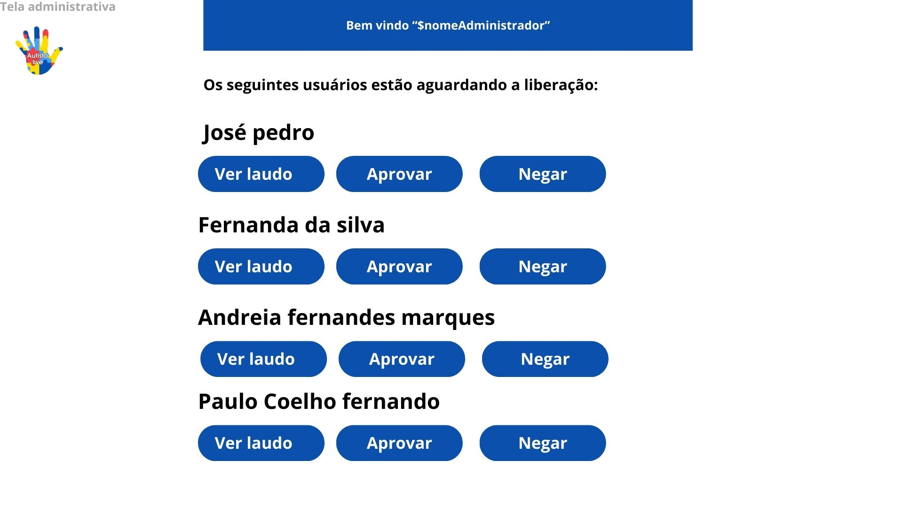

# Autista.live
Autista.live é uma solução de identificação digital desenvolvida para atender uma necessidade da comunidade autista. Este software foi projetado com o objetivo de oferecer uma maneira eficaz e personalizada de fornecer o laudo e uma identificação eletronica na palma da sua mão.
Com Autista.live, o usuário tem um perfil digital com foto, laudo e identificação digital, incluindo detalhes relevantes e necessidades de acordo com o laudo. 


## Comunicação
Temos um grupo para comunicação em tempo real aonde discutimos sobre o projeto no MATRIX.
Favor participar!

```
https://matrix.to/#/#autistalive:matrix.org
```
Se você estiver usando Linux, você pode usar os seguintes clientes: [Matrix Clients](https://matrix.org/ecosystem/clients/)

## Projeto Figma

https://www.figma.com/file/Mt6krhHmm91ZmDdXogFNxe/Autista.live?type=design&node-id=0%3A1&mode=design&t=Al4dT2HqrsSPBEnF-1

## Esboço
Este é um esboço inicial para o front!





## Obrigado aos contribuidores ❤

<a href = "https://github.com/Autistalive/web/graphs/contributors">
  
</a>
